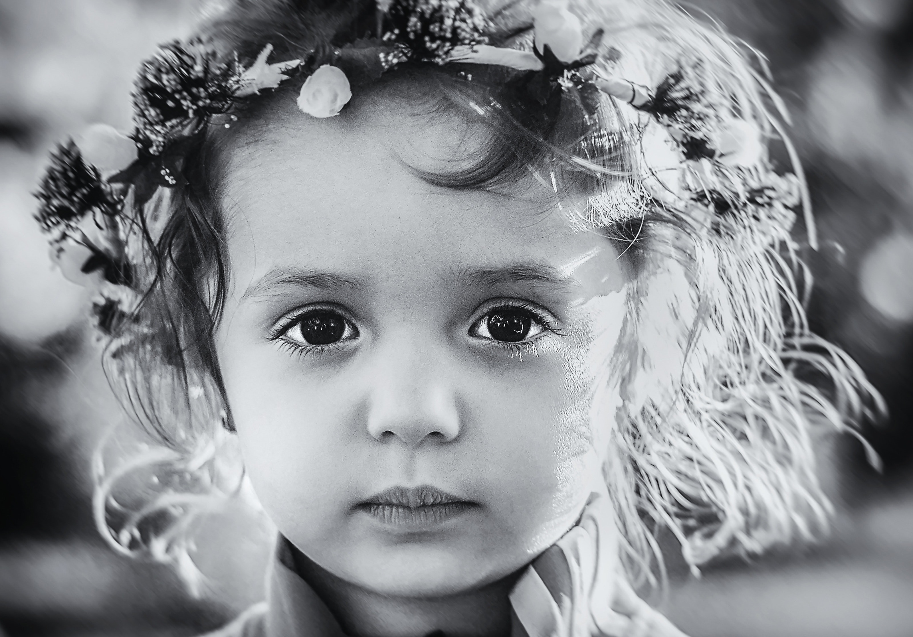
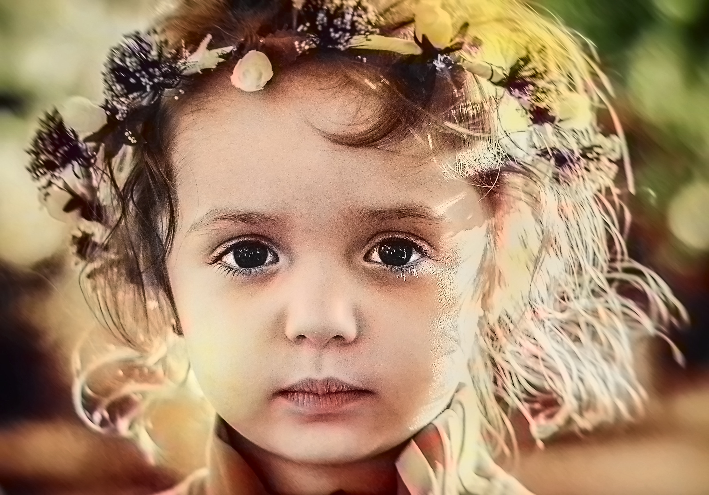

# image-colorizer-with-open-CV
Automatically adds realistic color to black and white images using OpenCV and deep learning.
Here's a professional and informative `README.md` description for your **Image Colorizer** project that uses **OpenCV**, **Flask**, **CNN**, and **Streamlit**:

---

# 🖌️ Image Colorizer

An AI-powered web application that colorizes black-and-white (grayscale) images using deep learning and computer vision. This project combines the power of **OpenCV**, a **Convolutional Neural Network (CNN)** model, and interactive front-ends using **Flask** and **Streamlit**.

## 🚀 Features

* 🧠 **Deep Learning Colorization**: Uses a pre-trained CNN model to automatically colorize grayscale images.
* 📷 **OpenCV Integration**: Handles image preprocessing and format conversion.
* 🌐 **Flask API**: Backend service for handling image uploads and inference.
* 🎛️ **Streamlit Frontend**: Simple, elegant interface for real-time image colorization.
* 🔄 **Dual Interface**: Use either Flask (web server) or Streamlit (interactive dashboard) for different deployment needs.

## 🛠️ Tech Stack

* **Python 3.8+**
* **OpenCV**
* **TensorFlow / Keras (for CNN model)**
* **Flask** – for RESTful API handling
* **Streamlit** – for interactive UI
* **NumPy**, **Pillow**, **Matplotlib** – for image processing and visualization

## 📁 Project Structure

```
image-colorizer/
├── app.py               # Flask application
├── streamlit_app.py     # Streamlit UI
├── colorization_model/  # CNN model files
├── static/              # For storing images (Flask)
├── templates/           # HTML templates for Flask
├── utils.py             # Utility functions for image preprocessing
├── requirements.txt     # Dependencies
└── README.md            # You're here!
```

## 📷 Sample

|    **Input (Grayscale)**    |       **Output (Colorized)**      |
| :-------------------------: | :-------------------------------: |
|  |  |

## 🧪 How to Run

### 🔧 1. Install Dependencies

```bash
pip install -r requirements.txt
```

### 💻 2. Run Flask App

```bash
python app.py
```

Then navigate to `http://127.0.0.1:5000` in your browser.

### 📊 3. Run Streamlit App

```bash
streamlit run streamlit_app.py
```

## 🧠 Model Info

The colorization model is based on a CNN architecture trained on large datasets (like ImageNet or COCO). You can use OpenCV’s pre-trained model or plug in your own trained model.

## 📌 TODO

* [ ] Add support for batch image uploads
* [ ] Convert colorized images to downloadable format
* [ ] Optimize performance for large images
* [ ] Add drag-and-drop image uploader in Streamlit

## 📄 License

This project is licensed under the MIT License.

---

Let me know if you want a more minimal, beginner-friendly, or academic-style version.
